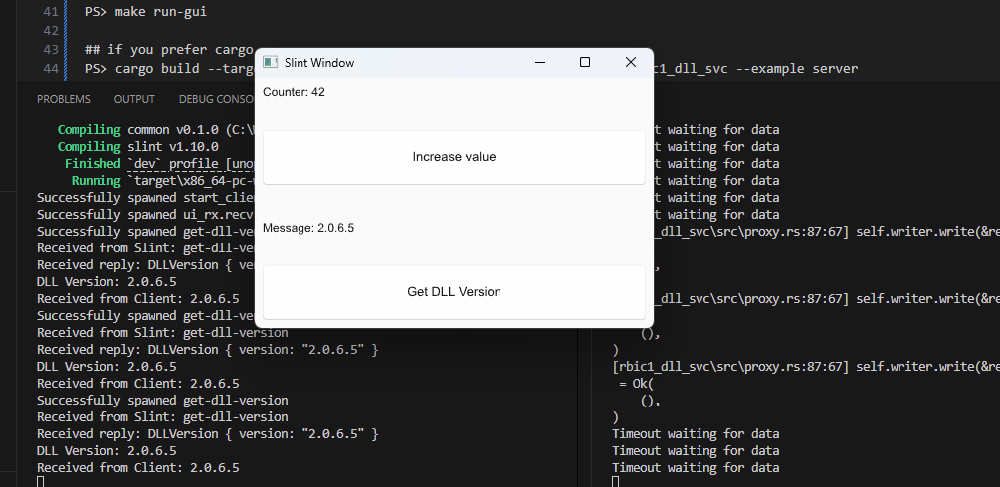

# A sample project that uses slint-ui, dust_dds and third party dll C/C++ library usage on windows with Rust

[Associated post](https://erturk.me/projects/zsc31050-calib-rust/)
    
   
   
The aim of the project is to develop a comprehensive system that runs on Windows 11 and is capable of communicating with remote systems using topics, such as in ROS2, instead of IP addresses.

There is a specific requirement for this project: we have a 32-bit legacy DLL, and our application should be 64-bit. In this case at least we need to develop two modules, one of them 32-bit and the other one is 64-bit. Consequently, we have to employ an IPC to exchange data between modules. There are lots of possibility such as gRPC but we don’t want to use IP addresses but topics. Even though it is not a best practice, this project will be a learning by doing project. Our main aim is discovering possibilities.

So let’s start!
___
### The Tools that Used within this Project
- Rust Toolchain with installed i686 and x86_64 target
- MSVC compilers
- DLLs from Renesas
- VS Code and Rust Analyzer plugin
- Git for Windows

___
### Setup
- Install Rustup
- Install MSVC compilers by using MSVC build tools with C/C++ workload
- the Optionally Make for Windows if you would like to build and run project by GNU Make
- Rest of process is clone project and run with your favorite tool... cargo, make or VS Code (settins included, see .vscode folder)
```
### installing required rust toolchains
PS> rustup toolchain install stable-x86_64-pc-windows-msvc
PS> rustup toolchain install stable-i686-pc-windows-msvc
```
___
### Running and Debugging
- Type just following commands in your favorite terminal app

```
PS> git clone https://github.com/ierturk/zsc31050-calib-rust.git
PS> cd zsc31050-calib-rust

## those commands need to be run on splitted terminals

## if you prefer GNU Make and you have one on Windows
PS> make run-server
PS> make run-gui

## if you prefer cargo
PS> cargo build --target i686-pc-windows-msvc --no-default-features -p rbic1_dll_svc --example server
PS> cargo build --target x86_64-pc-windows-msvc -p test_gui
```

If you prefer using VS Code to run tasks:   
Use ctrl-shift P then Tasks: Run task and select one

If everything is fine, you'll get following screen and see the communication.

## License

This project is licensed under the BSD 3-Clause License. See the [LICENSE](./LICENSE) file for details.
